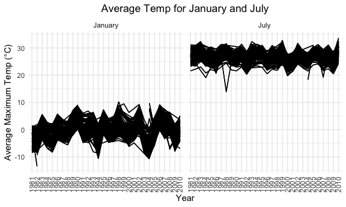

Homework 3
================
Yaa Ababio

``` r
library(tidyverse)
```

    ## ── Attaching packages ────────────────────────────────────────── tidyverse 1.3.0 ──

    ## ✓ ggplot2 3.3.2     ✓ purrr   0.3.4
    ## ✓ tibble  3.0.3     ✓ dplyr   1.0.2
    ## ✓ tidyr   1.1.2     ✓ stringr 1.4.0
    ## ✓ readr   1.3.1     ✓ forcats 0.5.0

    ## ── Conflicts ───────────────────────────────────────────── tidyverse_conflicts() ──
    ## x dplyr::filter() masks stats::filter()
    ## x dplyr::lag()    masks stats::lag()

``` r
library(hexbin)
library(ggridges)
library(patchwork)
library(p8105.datasets)

knitr::opts_chunk$set(
    fig.width = 6, 
  fig.asp = .6,
  out.width = "90%"
)
theme_set(theme_minimal() + theme(legend.position = "bottom"))
options(
  ggplot2.continuous.colour = "viridis",
  ggplot2.continuous.fill = "viridis"
)
scale_colour_discrete = scale_colour_viridis_d
scale_fill_discrete = scale_fill_viridis_d
```

### Problem 1

#### Describing the Instacart dataset

The `instacart` dataset contains information about users, types of
products, and purchase dates/times of items available on the online
grocery service Instacart. This data set is comprised of 1384617 rows
and 15 columns. There are 131209 distinct users, and each row in the
dataset represents a product from a order.

#### How many aisles, and which are most items ordered from?

``` r
aisles = 
instacart %>% 
    count(aisle) %>% 
    arrange(desc(n))
```

There are 134 aisles and the top 3 aisles with the most items ordered
from them are:

\*fresh vegetables - 150,609

\*fresh fruits - 150,473

\*packaged vegetables fruits - 78,493

#### Creating a plot with number of items (n\> 10,000) ordered in each aisle.

``` r
instacart %>% 
    count(aisle) %>% 
    filter(n > 10000) %>% 
    mutate(
        aisle = factor(aisle),
        aisle = fct_reorder(aisle, n)
    ) %>% 
    ggplot(aes(x = aisle, y = n)) + 
    geom_point() + 
    theme(axis.text.x = element_text(angle = 90, vjust = 0.5, hjust = 1))
```


#### Creating a table showing the 3 most popular items in the “baking ingredients”, “dog food care”, and “packaged vegetables fruits” aisles.

``` r
instacart %>% 
    filter(aisle %in% c("baking ingredients", "dog food care", "packaged vegetables fruits")) %>% 
    group_by(aisle) %>% 
    count(product_name) %>% 
    mutate(rank = min_rank(desc(n))) %>% 
    filter(rank < 4) %>% 
    arrange(aisle, rank) %>% 
    knitr::kable()
```

| aisle                      | product\_name                                 |    n | rank |
| :------------------------- | :-------------------------------------------- | ---: | ---: |
| baking ingredients         | Light Brown Sugar                             |  499 |    1 |
| baking ingredients         | Pure Baking Soda                              |  387 |    2 |
| baking ingredients         | Cane Sugar                                    |  336 |    3 |
| dog food care              | Snack Sticks Chicken & Rice Recipe Dog Treats |   30 |    1 |
| dog food care              | Organix Chicken & Brown Rice Recipe           |   28 |    2 |
| dog food care              | Small Dog Biscuits                            |   26 |    3 |
| packaged vegetables fruits | Organic Baby Spinach                          | 9784 |    1 |
| packaged vegetables fruits | Organic Raspberries                           | 5546 |    2 |
| packaged vegetables fruits | Organic Blueberries                           | 4966 |    3 |

#### Creating a table showing the mean hour of the day at which Pink Lady Apples and Coffee Ice Cream are ordered on each day of the week.

``` r
instacart %>% 
    filter(product_name %in% c("Pink Lady Apples", "Coffee Ice Cream")) %>% 
    group_by(product_name, order_dow) %>% 
    summarize(mean_hour = mean(order_hour_of_day)) %>% 
    pivot_wider(
        names_from = order_dow,
        values_from = mean_hour
    ) %>%
  knitr::kable()
```

    ## `summarise()` regrouping output by 'product_name' (override with `.groups` argument)

| product\_name    |        0 |        1 |        2 |        3 |        4 |        5 |        6 |
| :--------------- | -------: | -------: | -------: | -------: | -------: | -------: | -------: |
| Coffee Ice Cream | 13.77419 | 14.31579 | 15.38095 | 15.31818 | 15.21739 | 12.26316 | 13.83333 |
| Pink Lady Apples | 13.44118 | 11.36000 | 11.70213 | 14.25000 | 11.55172 | 12.78431 | 11.93750 |

### Problem 2

#### Load, tidy, and describe the accelerometer data set.

``` r
accel_df = read_csv("./data/accel_data.csv") %>%
  janitor::clean_names() %>%
  pivot_longer(
    activity_1:activity_1440,
    names_to = "minute",
    names_prefix = "activity_",
    values_to = "activity_count"
    ) %>%
  mutate(
    minute = as.numeric(minute),
    day = as.factor(day),
    day = fct_relevel(day, "Sunday", "Monday", "Tuesday", "Wednesday", "Thursday", "Friday", "Saturday"),
    weekend = as.numeric(day %in% c("Saturday", "Sunday")),
    day_type = factor(recode(weekend, '1' = "weekend", '0' = "weekday"))) %>%
  select(-weekend)
```

    ## Parsed with column specification:
    ## cols(
    ##   .default = col_double(),
    ##   day = col_character()
    ## )

    ## See spec(...) for full column specifications.

The Accelerometer dataset contains 5 weeks of accelerometer data
collected from a 63 year old male CUMC patient with congestive heart
failure. This dataset is comprised of 50400 observations and 6
variables. Variables include: week, day\_id, day, minute,
activity\_count, day\_type. The activity count in this dataset ranges
from 1 to 8982. The tidy dataset specifies whether a day is a weekday or
weekend via the day\_type variable, and has collapsed the activity count
into a more easily understandable format.

#### Creating total activity per day variable and associated table. Describing trends within the table.

``` r
activity_per_day =
accel_df %>%
  group_by(day, week) %>%
  summarize(total_activity = sum(activity_count)) %>%
  pivot_wider(
    names_from = day,
    values_from = total_activity)
```

    ## `summarise()` regrouping output by 'day' (override with `.groups` argument)

``` r
activity_per_day %>%
  knitr::kable()
```

| week | Sunday |    Monday |  Tuesday | Wednesday | Thursday |   Friday | Saturday |
| ---: | -----: | --------: | -------: | --------: | -------: | -------: | -------: |
|    1 | 631105 |  78828.07 | 307094.2 |    340115 | 355923.6 | 480542.6 |   376254 |
|    2 | 422018 | 295431.00 | 423245.0 |    440962 | 474048.0 | 568839.0 |   607175 |
|    3 | 467052 | 685910.00 | 381507.0 |    468869 | 371230.0 | 467420.0 |   382928 |
|    4 | 260617 | 409450.00 | 319568.0 |    434460 | 340291.0 | 154049.0 |     1440 |
|    5 | 138421 | 389080.00 | 367824.0 |    445366 | 549658.0 | 620860.0 |     1440 |

The highest amount of activity appears on Monday during week 3, and the
lowest amount of activity appears to occur on Saturday during weeks 4
and 5. Upon further assessment of the low activity counts for Saturday
week 4 & 5, it appears that activity count was recorded as ‘1’ for every
minute during each of those days (total of 1440 minutes per day). This
may be a potential device measurement error.

#### Creating a single-panel plot that shows the 24-hour activity time courses for each day.

``` r
accel_df %>%
  ggplot(aes(x = minute, y = activity_count, group = day_id, color = day)) + 
  geom_line(aes(group = day), alpha = 0.2) +
  geom_smooth(aes(group = day), se = FALSE) +
  labs(
    title = "24 hr Activity Time Courses"
    ) + 
  theme(plot.title = element_text(hjust = 0.5))
```

    ## `geom_smooth()` using method = 'gam' and formula 'y ~ s(x, bs = "cs")'


The plot suggests that activity on Fridays tends to be highest at the
end of the day, whereas activity on Sundays tends to be highest in the
middle of the day. Activity on Saturdays is relatively consistent
throughout the day, and dips towards the end of the day. Because of the
nature of the conflating lines of this plot, it is difficult to discern
more information and further analysis or differing visual representation
may be needed.

### Problem 3

#### Exploring and describing the NY NOAA dataset.

The `ny_noaa` dataset describes weather information collected from New
York state weather stations from January 1st, 1981 to December 31st,
2010. It consists of 2595176 rows , 7 columns, and the following
variables: id, date, prcp, snow, snwd, tmax, tmin. These variables
describe the unique weather station ID, date of observation,
precipitation, snowfall, snow depth, maximum temperature, and minimum
temperature.

Information regarding missing values in the dataset is as follows:

  - total `NA`s in df: 3387623

  - `prcp`:145838 `NA`s

  - `snow`: 381221 `NA`s

  - `snwd`: 591786 `NA`s

  - `tmax`: 1134358 `NA`s

  - `tmin`: 1134420 `NA`s

There appear to be a significant number of missing values in the above
mentioned variables. These may need to dropped from the dataset during
the data visualization process.

#### Cleaning the NOAA dataset by separating the date variable and ensuring reasonable measurement units.

``` r
ny_noaa_clean = 
 ny_noaa %>%
 separate(date, into = c("year", "month", "day"), convert = TRUE) %>%
 mutate(
   prcp = prcp/10,
   year = as.factor(year),
   month = as.numeric(month),
   day = as.numeric(day),
   tmax = as.numeric(tmax)/10,
   tmin = as.numeric(tmin)/10
 )
```

Note that precipitation (`prcp`) has been converted from tenths of mm to
mm to allow for uniformity (in comparison to snowfall and snow depth,
which are also measured in mm). Additionally, temperature (`tmin` and
`tmax`) have been converted from tenths of degrees Celsius to degrees
Celsius to make the data more readily interpretable.

#### Determining the most comonly observed snowfall value.

``` r
ny_noaa_clean %>%
 count(snow, name = "n_obs") %>%
 mutate(rank = min_rank(n_obs)) %>%
 arrange(desc(rank))
```

    ## # A tibble: 282 x 3
    ##     snow   n_obs  rank
    ##    <int>   <int> <int>
    ##  1     0 2008508   282
    ##  2    NA  381221   281
    ##  3    25   31022   280
    ##  4    13   23095   279
    ##  5    51   18274   278
    ##  6    76   10173   277
    ##  7     8    9962   276
    ##  8     5    9748   275
    ##  9    38    9197   274
    ## 10     3    8790   273
    ## # … with 272 more rows

The most commonly observed snowfall value (i.e. observation with the
largest rank number) is 0 mm. This makes sense, because for most of the
calendar year it is not snowing at all.

#### Creating a two-panel plot for average max temperature in January and July.

``` r
ny_noaa_clean %>%
filter(month %in% c("1", "7")) %>%
mutate(month = month.name[month]) %>%
group_by(id, year, month) %>%
summarize(mean_tmax = mean(tmax, na.rm = TRUE)) %>%
ggplot(aes(x = year, y = mean_tmax, group = id)) +
  geom_line() +
  geom_path() +
  facet_grid(~ month) +
  labs(title = "Average Temp for January and July", x = "Year", y = "Average Maximum Temp (°C)") +
  theme(axis.text.x = element_text(angle = 90, vjust = 0.5, hjust = 1)) + 
  theme(legend.position = "none") +
  theme(plot.title = element_text(hjust = 0.5))
```

    ## `summarise()` regrouping output by 'id', 'year' (override with `.groups` argument)

    ## Warning: Removed 5640 row(s) containing missing values (geom_path).

    ## Warning: Removed 5931 row(s) containing missing values (geom_path).



There is a clear, interpretable structure. As expected, the average
maximum temperature for January is much lower than that of July between
the years 1980 and 2010. The average maximum temperature for January
ranges from approximately -10 °C to 10 °C, whereas the average maximum
temperature from approximately 20°C to 30°C. There appear to be outliers
present in the data. The outliers for January tend to be above average
temperatures, whereas the outliers for July tend to be below average
temperatures.

#### Creating a two-panel plot showing (i) tmax vs. tmin and the (ii) distribution of snowfall values.

``` r
tmaxmin =
  ny_noaa_clean %>%
  drop_na(tmax, tmin) %>%
  ggplot(aes(x = tmin, y = tmax)) +
  labs(
    title = "Temperature (max vs. min) Hexplot",
    x = "Minimum Daily Temperature (C)",
    y = "Maximum Daily Temperature (C)") +
  geom_hex() +
  theme(plot.title = element_text(hjust = 0.5)) +
  theme(legend.text = element_text(hjust = 1)) +
  theme(legend.position = "right") +
  theme(legend.box = "horizontal")
  

snow_dist = 
  ny_noaa_clean %>%
  drop_na(snow) %>%
  filter(snow > 0 & snow < 100) %>%
  ggplot(aes(x = year, y = snow)) +
  labs(
    title = "Snowfall Values Boxplot",
    x = "Year",
    y = "Snowfall (mm)") +
  geom_boxplot(aes(group = year)) +
  theme(plot.title = element_text(hjust = 0.5)) +
  theme(axis.text.x = element_text(angle = 90, hjust = 1))
  
     
tmaxmin + snow_dist
```


