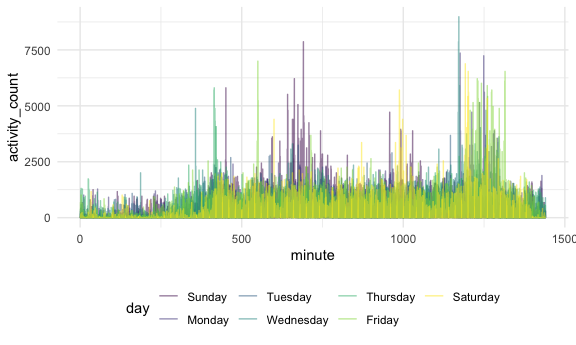
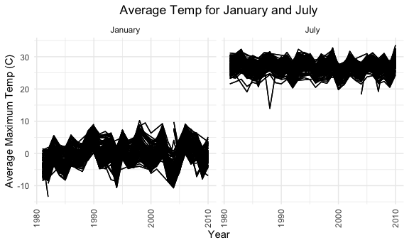

Homework 3
================

### Problem 1

#### How many aisles, and which are most items from?

``` r
instacart %>% 
    count(aisle) %>% 
    arrange(desc(n))
```

    ## # A tibble: 134 x 2
    ##    aisle                              n
    ##    <chr>                          <int>
    ##  1 fresh vegetables              150609
    ##  2 fresh fruits                  150473
    ##  3 packaged vegetables fruits     78493
    ##  4 yogurt                         55240
    ##  5 packaged cheese                41699
    ##  6 water seltzer sparkling water  36617
    ##  7 milk                           32644
    ##  8 chips pretzels                 31269
    ##  9 soy lactosefree                26240
    ## 10 bread                          23635
    ## # … with 124 more rows

#### Creating a plot

``` r
instacart %>% 
    count(aisle) %>% 
    filter(n > 10000) %>% 
    mutate(
        aisle = factor(aisle),
        aisle = fct_reorder(aisle, n)
    ) %>% 
    ggplot(aes(x = aisle, y = n)) + 
    geom_point() + 
    theme(axis.text.x = element_text(angle = 90, vjust = 0.5, hjust = 1))
```


#### Creating a table

``` r
instacart %>% 
    filter(aisle %in% c("baking ingredients", "dog food care", "packaged vegetables fruits")) %>% 
    group_by(aisle) %>% 
    count(product_name) %>% 
    mutate(rank = min_rank(desc(n))) %>% 
    filter(rank < 4) %>% 
    arrange(aisle, rank) %>% 
    knitr::kable()
```

| aisle                      | product\_name                                 |    n | rank |
| :------------------------- | :-------------------------------------------- | ---: | ---: |
| baking ingredients         | Light Brown Sugar                             |  499 |    1 |
| baking ingredients         | Pure Baking Soda                              |  387 |    2 |
| baking ingredients         | Cane Sugar                                    |  336 |    3 |
| dog food care              | Snack Sticks Chicken & Rice Recipe Dog Treats |   30 |    1 |
| dog food care              | Organix Chicken & Brown Rice Recipe           |   28 |    2 |
| dog food care              | Small Dog Biscuits                            |   26 |    3 |
| packaged vegetables fruits | Organic Baby Spinach                          | 9784 |    1 |
| packaged vegetables fruits | Organic Raspberries                           | 5546 |    2 |
| packaged vegetables fruits | Organic Blueberries                           | 4966 |    3 |

#### Apples vs ice cream

``` r
instacart %>% 
    filter(product_name %in% c("Pink Lady Apples", "Coffee Ice Cream")) %>% 
    group_by(product_name, order_dow) %>% 
    summarize(mean_hour = mean(order_hour_of_day)) %>% 
    pivot_wider(
        names_from = order_dow,
        values_from = mean_hour
    )
```

    ## `summarise()` regrouping output by 'product_name' (override with `.groups` argument)

    ## # A tibble: 2 x 8
    ## # Groups:   product_name [2]
    ##   product_name       `0`   `1`   `2`   `3`   `4`   `5`   `6`
    ##   <chr>            <dbl> <dbl> <dbl> <dbl> <dbl> <dbl> <dbl>
    ## 1 Coffee Ice Cream  13.8  14.3  15.4  15.3  15.2  12.3  13.8
    ## 2 Pink Lady Apples  13.4  11.4  11.7  14.2  11.6  12.8  11.9

### Problem 2

#### Load, tidy, and describe the accelerometer data set.

``` r
accel_df = read_csv("./data/accel_data.csv") %>%
  janitor::clean_names() %>%
  pivot_longer(
    activity_1:activity_1440,
    names_to = "minute",
    names_prefix = "activity_",
    values_to = "activity_count"
    ) %>%
  mutate(
    minute = as.numeric(minute),
    day = as.factor(day),
    day = fct_relevel(day, "Sunday", "Monday", "Tuesday", "Wednesday", "Thursday", "Friday", "Saturday"),
    weekend = as.numeric(day %in% c("Saturday", "Sunday")),
    day_type = factor(recode(weekend, '1' = "weekend", '0' = "weekday"))) %>%
  select(-weekend)
```

    ## Parsed with column specification:
    ## cols(
    ##   .default = col_double(),
    ##   day = col_character()
    ## )

    ## See spec(...) for full column specifications.

#### data description

#### Creating total activity per day variable and associated table.

``` r
test =
accel_df %>%
  group_by(day, week) %>%
  summarize(total_activity = sum(activity_count)) %>%
  pivot_wider(
    names_from = day,
    values_from = total_activity)
```

    ## `summarise()` regrouping output by 'day' (override with `.groups` argument)

``` r
test %>%
  knitr::kable()
```

| week | Sunday |    Monday |  Tuesday | Wednesday | Thursday |   Friday | Saturday |
| ---: | -----: | --------: | -------: | --------: | -------: | -------: | -------: |
|    1 | 631105 |  78828.07 | 307094.2 |    340115 | 355923.6 | 480542.6 |   376254 |
|    2 | 422018 | 295431.00 | 423245.0 |    440962 | 474048.0 | 568839.0 |   607175 |
|    3 | 467052 | 685910.00 | 381507.0 |    468869 | 371230.0 | 467420.0 |   382928 |
|    4 | 260617 | 409450.00 | 319568.0 |    434460 | 340291.0 | 154049.0 |     1440 |
|    5 | 138421 | 389080.00 | 367824.0 |    445366 | 549658.0 | 620860.0 |     1440 |

#### Creating a single-panel plot that shows the 24-hour activity time courses for each day.

``` r
activity_plot =
accel_df %>%
  ggplot(aes(x = minute, y = activity_count, color = day)) + 
  #geom_line(aes(group = day))
  geom_smooth(aes(group = day), se = FALSE)
  labs(
    title = "24 hr Activity Time Courses"
    
  )
```

    ## $title
    ## [1] "24 hr Activity Time Courses"
    ## 
    ## attr(,"class")
    ## [1] "labels"

``` r
print(activity_plot)
```

    ## `geom_smooth()` using method = 'gam' and formula 'y ~ s(x, bs = "cs")'



#### Description of plot

### Problem 3

##### Data exploration and description

##### Data cleaning

``` r
ny_noaa_clean = 
 ny_noaa %>%
 separate(date, into = c("year", "month", "day"), convert = TRUE) %>%
 mutate(
   prcp = prcp/10,
   year = as.numeric(year),
   month = as.numeric(month),
   day = as.numeric(day),
   tmax = as.numeric(tmax)/10,
   tmin = as.numeric(tmin)/10
 )
```

#### Most commmonly observed snowfall value

``` r
common_snow = 
ny_noaa_clean %>%
  group_by(snow) %>%
  summarize(n_obs = n()) 
```

    ## `summarise()` ungrouping output (override with `.groups` argument)

#### Max temp in January and July

``` r
ny_noaa_clean %>%
filter(month %in% c("1", "7")) %>%
mutate(month = month.name[month]) %>%
group_by(id, year, month) %>%
summarize(mean_tmax = mean(tmax, na.rm = TRUE)) %>%
ggplot(aes(x = year, y = mean_tmax, group = id, color = id)) +
  geom_point() +
  geom_path() +
  facet_grid(~ month) +
  labs(title = "Average Temp for January and July", x = "Year", y = "Average Maximum Temp (C)") +
  theme(axis.text.x = element_text(angle = 90, vjust = 0.5, hjust = 1)) + 
  theme(legend.position = "none") +
  theme(plot.title = element_text(hjust = 0.5))
```

    ## `summarise()` regrouping output by 'id', 'year' (override with `.groups` argument)

    ## Warning: Removed 5970 rows containing missing values (geom_point).

    ## Warning: Removed 5931 row(s) containing missing values (geom_path).



#### Two-panel plot

``` r
tmaxmin =
  ny_noaa_clean %>%
  drop_na(tmax, tmin) %>%
  ggplot(aes(x = tmin, y = tmax)) +
  labs(
    title = "Temperature (max vs. min) Hexplot",
    x = "Minimum Daily Temperature (C)",
    y = "Maximum Daily Temperature (C)") +
  geom_hex() +
  theme(plot.title = element_text(hjust = 0.5)) +
  theme(legend.text = element_text(hjust = 1)) +
  theme(legend.position = "right") +
  theme(legend.box = "horizontal")
  

snow_dist = 
  ny_noaa_clean %>%
  drop_na(snow) %>%
  filter(snow > 0 & snow < 100) %>%
  ggplot(aes(x = year, y = snow)) +
  labs(
    title = "Distribution of Snowfall Values Boxplot",
    x = "Year",
    y = "Snowfall (mm)") +
  geom_boxplot(aes(group = year)) +
  theme(plot.title = element_text(hjust = 0.5))
  
      
  
 par(mfrow = c(1,2))
 tmaxmin
```


``` r
 snow_dist
```


